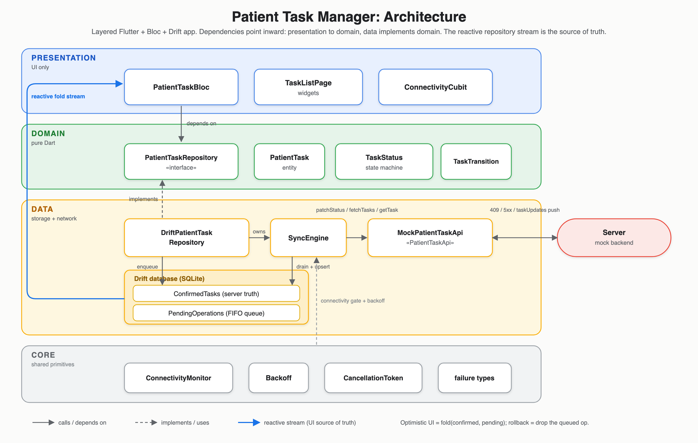

# Patient Task Manager

A small Flutter app for managing patient tasks (e.g. "Draw blood sample →
In progress → Completed"). Its point is **offline-first sync**: you can change a
task's status with no network, see the change instantly, and the app quietly
syncs it to the server in the background, retrying, resolving conflicts, and
rolling back if the server ultimately rejects it.

Built with **Flutter + Bloc + Drift**.

---

## Quick start

The Flutter SDK version is pinned with [fvm](https://fvm.app/) (see `.fvmrc` →
3.44.5) so everyone builds with the same version. Prefix commands with `fvm`
(or use the `makefile` shortcuts).

```bash
fvm install                                                    # get the pinned Flutter SDK
fvm flutter pub get                                            # fetch packages
fvm dart run build_runner build --delete-conflicting-outputs   # generate code (Drift + Freezed)
fvm flutter run                                                # launch the app
fvm flutter analyze                                            # static checks (should be zero issues)
fvm flutter test                                               # run the full test suite
```

`makefile` shortcuts: `make fresh` (clean + pub get), `make build-runner`, `make lint`.

> **Why** `build_runner`**?** Some classes are partly *generated*: Drift generates the
> database code, and Freezed generates value-type boilerplate (equality,
> `copyWith`, JSON). You run `build_runner` once to (re)generate the `*.g.dart` /
> `*.freezed.dart` files.

The app starts with 50 seeded tasks and a **mock server** that deliberately fails
~15% of calls, so you can actually see the interesting behaviour: the "Syncing…"
badge, automatic retries with backoff, and, when a queued change is no longer
legal, a rollback with a snackbar.

> **Heads-up:** a few seconds after launch, tasks will start changing status **on
> their own**, every ~5 seconds. That is intentional: the mock server simulates
> another clinician editing tasks in the background, which is what drives the sync
> and conflict behaviour. It is not instability. Tune or disable it in one place
> (`MockPatientTaskApi` in `lib/di/app_dependencies.dart`): raise `pushInterval` to
> slow it down, or set `failureRate: 0.0` to stop the simulated network errors.
>
> **To watch offline sync:** turn on **airplane mode**, and the app-bar badge flips to a
> red **● Offline**. Change a few task statuses and they queue up in `PendingOperations`
> (the "Syncing…" badge count climbs); turn the network back on (badge → green **●
> Online**) and the queue drains, followed by one authoritative refetch that reconciles
> anything that changed while you were away. Sync is gated on real device connectivity
> (see ADR-006/007), so no special build or flag is needed.

---


## The core idea

When you tap "Start" on a task, here is what happens:

1. **Instantly (no network):** the app records your intent in a local queue and the
  UI updates immediately. This is called an **optimistic update**: we optimistically
   assume the server will accept it, so we don't make you wait.
2. **In the background:** a *sync engine* takes that queued change and sends it to
  the server. If the network hiccups, it retries with increasing delays. A small
   "Syncing…" badge shows while there's unsent work.
3. **If the server accepts:** the local "confirmed" copy is updated and the queued
  change disappears. The UI doesn't visibly change; your optimistic guess was
   right.
4. **If the server rejects it** (someone else already moved the task somewhere that
  makes your change illegal): the app drops the queued change, the task snaps back
   to the server's truth, and you get a snackbar explaining why.

Everything below is the machinery that makes those four steps correct and testable.

---


## Architecture

The code is organised in **layers**, and dependencies only ever point **inward**
(`presentation → domain ← data`). Inner layers (domain) know nothing about outer
ones (UI, database, network). This is what makes pieces swappable and testable.



**What each layer is for**

- **domain/**: the rules and vocabulary of the app, in plain Dart. `TaskStatus`
holds the **state machine** (which status can move to which). An illegal move is
**impossible to construct**, not merely rejected in the UI: a mutation must go
through `TaskTransition.tryCreate`, which returns null for a forbidden move, and
the repository passes that proven transition on to the queue. It has no idea a
database or UI exists, so it's trivial to unit-test.
- **data/**: how data is actually stored (Drift/SQLite) and fetched (the API). It
*implements* the interfaces the domain defines.
- **presentation/**: the Bloc and widgets. The Bloc turns user events into UI
states; widgets just render state and dispatch events.

**Three "interfaces" (contracts) make things swappable:**

- `PatientTaskRepository`: the only thing the Bloc talks to for data. Today it's
backed by Drift; you could swap in a pure-HTTP version without touching the Bloc.
- `PatientTaskApi`: the server contract. Today it's an in-memory `MockPatientTaskApi`;
a real HTTP client would drop in behind the same interface.
- `ConnectivityMonitor` (in `core/connectivity/`): the device's online/offline signal,
in one place (a **required** dependency, see ADR-006/007). It exposes a seeded
`connectivity` stream (the app-facing signal) plus the raw `onStatusChange` / `isOnline()`
pieces, and feeds **everyone**: the `SyncEngine` (gates the drain), the `PatientTaskBloc`
(refresh-on-reconnect), the `ConnectivityCubit` (the app-bar badge), and the repository's
own gating. Because it feeds more than the sync package it lives in `core`. It wraps
`connectivity_plus` directly; the `Connectivity` client is constructor-injectable so tests
pass a fake (or `implements ConnectivityMonitor` for a simple bool-stream stub).

> **Bloc, in one line:** a class that receives *events* (e.g. "user tapped Start")
> and emits *states* (e.g. "Loaded with these tasks"); the UI rebuilds from state.
> **Repository pattern:** an interface that hides *where* data comes from, so
> callers don't care if it's a DB, an API, or a fake.

---


## Domain model & FHIR alignment

`PatientTask` is **loosely shaped after a FHIR R4** `Task` (as the brief frames it): a
faithful subset, not a full FHIR implementation. What maps to real FHIR:


| App field                                  | FHIR `Task`                                    | Notes                                                                                          |
| ------------------------------------------ | ---------------------------------------------- | ---------------------------------------------------------------------------------------------- |
| `status`                                   | `Task.status`                                  | Values are real FHIR codes; the wire DTO emits FHIR **kebab-case** (`in-progress`, `on-hold`). |
| `priority`                                 | `Task.priority`                                | Exactly the FHIR request-priority value set (`routine | urgent | asap | stat`).                |
| `patientReference` (`"Patient/123"`)       | `Task.for` → `Reference(Patient)`              | Correct reference shape.                                                                       |
| `assignee` (`"Practitioner/45"`)           | `Task.owner` → `Reference(Practitioner)`       |                                                                                                |
| `lastModified`                             | `Task.lastModified`                            | "Server time of last accepted write."                                                          |
| `version` + 409 on stale `expectedVersion` | `meta.versionId` + ETag / `If-Match` → 409/412 | Models FHIR **optimistic concurrency**, not a toy counter.                                     |


**Deliberate simplifications** (appropriate for the timebox, called out so nothing
over-claims):

- **Status is a 5-state subset.** Full FHIR `Task.status` also has `draft, received, accepted, rejected, ready, failed, entered-in-error`. The brief defined this exact
5-state machine, so the app implements that; for a real clinical system I'd want
`entered-in-error` at minimum (voiding a mistaken task; "cancelled" doesn't cover that
semantically).
- `intent` **/** `code` **omitted.** FHIR requires `Task.intent` (proposal/plan/order) and
separates `Task.code` (coded "what") from `Task.description` (free text); here that
collapses to a single `title`.
- **References are plain strings**, not typed `Reference` objects.
- **The transition state machine is an app decision**, not FHIR-normative. FHIR guides
lifecycle via workflow / `businessStatus` rather than mandating a fixed graph. Enforcing
one is the right *product* call for this clinical domain; it just isn't dictated by FHIR.

Wire-name mapping lives in the data-layer DTO (`PatientTaskModel`), not on the domain
enums, so the FHIR string format stays an API concern and reordering an enum never
shifts the wire contract.

---


## How offline sync works (the heart of the app)

There are **two local tables**, and the list you see is *computed* from both:

- `ConfirmedTasks`: the last thing we know the **server** agreed to.
- `PendingOperations`: a **queue** of local changes you've made that haven't been
accepted yet (each is one "move task X from status A to B").

The displayed list = **confirmed rows with the pending changes layered on top**. We
call that layering the **fold**. Crucially, the optimistic result is *computed on
the fly*, never saved as a third copy, so "undo" is just removing a queued item.


**(A) You make a change** → `repository.updateStatus(taskId, next)`:
it checks the move is legal (against the *folded* current status, so several quick
changes chain correctly), adds one item to the queue, and returns. There is **no
network call**. Because the queue changed, the fold recomputes and the UI shows your
change.

**(B) The sync engine drains the queue** → one change at a time, oldest first
(`SyncEngine`), **only while the device is online** (draining pauses when there's no
connectivity and resumes when it returns, see ADR-006). For each queued change it
calls the server's `patchStatus`:

- **Success** → save the server's updated row (see *version-guarded upsert* below)
and remove the item from the queue. The optimistic change has simply become
confirmed.
- **Temporary failure** (flaky network / 5xx) → wait a bit and retry the same item
(see *exponential backoff* below).
- **Conflict** (the server's version moved under us) → *server wins + re-validate*
(see ADR-002).
- **Offline** → the change stays queued; nothing is sent until the device is back
online, at which point the queue drains automatically.

**(C) The server pushes updates** (another clinician changed something) →
`taskUpdates` → **while online**, we save it into `ConfirmedTasks`. Because your queued
changes live in a *separate* table and are folded *on top*, a server push can never
overwrite your un-synced work. **While offline** these live pushes are dropped (you
have no link to receive them); on reconnect the repository runs one authoritative
`refresh()` to catch the confirmed layer up in a single bounded fetch, rather than
replaying a backlog of stale deltas (see ADR-007).

**(D) A queued change is rolled back** → when the conflict re-validation in (B) finds
the move is *no longer legal* against the server's new state, the item is dropped from
the queue and the engine emits a `SyncRejection(taskId, reason)`. The Bloc turns that
into a snackbar so the user is told, and because the op is gone the fold recomputes and
the row reverts to server truth. This is the only path that discards a local change (see
ADR-002).

> **Version-guarded upsert:** every task has a `version` number that the server
> increments on each change. When we save a server row locally, we only overwrite
> if the incoming `version` is **higher** than what we have. This makes saves
> idempotent (saving the same thing twice is harmless) and safe against
> out-of-order messages (an old update can't clobber a newer one).

---


## Architecture Decision Records (ADRs)

An ADR records *why* a significant choice was made: the problem, the decision, and
the roads not taken, so a future reader (or interviewer) doesn't have to guess.

### ADR-001: Local storage with Drift (SQLite)

**Context.** The app needs on-device storage for the two tables, and the UI must
update automatically whenever the data changes.

**Decision.** Use **Drift** (a typed wrapper over SQLite).

**Why.** Two things matter here:

1. **Typed, compile-checked queries.** Mistakes are caught at compile time, not at
  runtime in front of a user.
2. **Reactive** `watch()` **queries.** A Drift query can return a *stream* that
  re-emits every time the underlying rows change. The whole UI-updates-itself
   behaviour falls out of this: the fold is just "combine the two tables' `watch()`
   streams," and the screen re-renders on any change.

**Alternatives considered.**

- **sqflite**: lower-level; queries are raw strings (typos found at runtime) and
rows are mapped by hand. More boilerplate, less safety.
- **Hive / Isar**: fast NoSQL stores, but the data is relational (a queue that
references tasks, per-row versioning), which SQL models more naturally, and the
reactive-join story is weaker.

**Consequence / bonus.** The database is created with a `QueryExecutor` passed in,
so tests inject an **in-memory** SQLite. Tests therefore run against *real* database
code (real SQL, real transactions) instead of a fake, for much higher confidence.

### ADR-002: Conflict handling (server wins, then re-validate)

**Context.** "Optimistic concurrency" means the server can reject a write if it was
based on stale data. Concretely: each change carries the `version` it was made
against; if the server's version has moved on, it replies **409 Conflict**. The app
must decide what to do when that happens. This is healthcare, and silently guessing
wrong is not acceptable.

**Decision.** **Server wins, but a now-illegal move is never blindly applied.** On a
409 the engine:

1. re-reads the task's current server row (`getTask`),
2. saves it locally (the server's version is the source of truth),
3. re-checks the pending change against the state machine from that new status:
  - **still legal** → update the change's baseline version and retry it,
  - **illegal** (e.g. the task is now `completed`, and a completed task cannot
  move) → drop the change and emit a `SyncRejection` so the UI can tell the user.

**Alternatives considered.**

- **Last-write-wins**: whoever writes last overwrites everyone. Simple, but a stale
phone could silently undo a clinician's correction. Unsafe here.
- **Always prompt the user to resolve**: correct for rich edits, but overkill and
annoying for simple status toggles. Kept as a future option for sensitive fields.

**Consequence.** The server is authoritative, and only changes that are still valid
are ever applied, which matches how a clinical system should behave.

**Known limitation (clinical safety), and what I'd change for a real system.** "Server
wins" treats every terminal state as equivalent, which is unsafe for one specific race.
Say a nurse marks "Draw blood" **completed** while offline (the blood was physically
drawn), and meanwhile another client **cancels** that task on the server. On reconnect the
completed op is dropped and the task snaps to `cancelled`, silently erasing the record of an
action that actually happened. That is backwards for a clinical audit trail: `completed` is
a statement of *fact* (it occurred), while `cancelled` is a statement of *intent*, and a
fact should not be overwritten by an intent without a human in the loop. For production I
would:

1. **Escalate, not auto-resolve, terminal-vs-terminal conflicts** (and any conflict where

the local intent is `completed`): show a prompt-user resolution ("you completed this
offline; the server cancelled it, which is correct?") instead of a silent `SyncRejection`.
This is the spec's "prompt-user" strategy, applied to the one case that earns the friction.
2. **Never silently drop the losing intent**: record it (an audit event / FHIR `Provenance`,
or a "disputed" flag) so the clinician's action survives even if the display reverts. FHIR
voids a genuinely mistaken terminal write via `entered-in-error` + `Provenance`, not a blind
overwrite.
3. Optionally encode **domain precedence** (e.g. `completed` is sticky and needs an explicit
override), so the common case resolves safely without prompting.

Kept out of scope here on purpose (server-wins is the justified default for the timebox),
but flagged because it is a real safety gap, not a cosmetic one.

### ADR-003: Async correctness via Bloc event transformers

**Context.** When events arrive in bursts (rapid taps, fast typing), *how* the Bloc
processes them changes correctness. A **transformer** controls that. The options:
`sequential` (one at a time, in order), `droppable` (ignore new ones while busy),
`restartable` (cancel the running one, start the new one, a.k.a. *switchMap*), and
`concurrent` (all at once, the default).

**Decision.** One transformer per event, chosen for that event's needs:


| Event                       | Transformer                           | Plain-English reason                                                                                                                                                                                                     |
| --------------------------- | ------------------------------------- | ------------------------------------------------------------------------------------------------------------------------------------------------------------------------------------------------------------------------ |
| `TaskStatusChangeRequested` | `sequential()`                        | Rapid status changes must reach the repo **in the order tapped**, because each new change is validated against the previous one. `droppable` would silently lose taps; `restartable` could cancel a change half-written. |
| `SearchQueryChanged`        | `debounceTime(300ms)` + `restartable` | **Debounce** = wait 300 ms after the last keystroke before searching, so typing "blood" is one search, not five. **restartable** = if a newer query arrives, cancel the older in-flight request.                         |
| `RefreshRequested`          | `droppable()`                         | If a refresh is already running, ignore extra taps rather than queue a pile of redundant round-trips.                                                                                                                    |
| `TaskListSubscribed`        | default + manual cancel               | Sets up the long-lived subscription to the data streams; re-subscribing cleanly cancels the previous one.                                                                                                                |


**Real cancellation.** `restartable` cancels the Bloc *handler*, but a Dart `Future`
already in flight keeps running. So for search a small `CancellationToken` is
threaded all the way to `fetchTasks`: a superseded search **aborts before writing**
its (stale) results. This mirrors a real HTTP client's `CancelToken`.

**Belt and braces.** Ordering is *also* guaranteed further down: the queue is FIFO
and the sync engine sends one change at a time, so even the network calls go out in
order regardless of the Bloc.

### ADR-004: Optimistic state as two layers, not a "dirty" flag

**Context.** With optimistic UI, the app must track "what the server confirmed" vs
"what the user did that isn't synced yet." Two common designs: (a) one table with a
per-row **dirty flag**, or (b) **two layers** (confirmed + a queue of pending
changes).

**Decision.** Two layers, with the visible state **derived by folding** them at read
time (never stored as a third copy).

**Why.**

- **Rollback is trivial**: undoing a change is just deleting its queued item; there's
no flag to reset and no separate optimistic copy to reconcile.
- **A server push can't clobber unsynced work**: pushes only ever write the
*confirmed* table (via the version-guarded upsert), and the pending changes are
folded on top of that. The two never fight over the same row.

**Queue ordering: FIFO, not "coalescing."** Every change is kept in order rather than
merging a rapid A→B→A→B into a single net change. Why: transitions are validated
*step by step*, so collapsing them could produce an illegal shortcut (e.g. jumping
`requested → completed` directly, which the state machine forbids). Merging correctly
would have to be state-machine-aware, so it is deferred (see cuts).

### ADR-005: Dependency injection via plain constructor injection

**Context.** Objects need their dependencies (the Bloc needs the repository, the
repository needs the DAOs + API + sync engine). **Dependency injection (DI)** just
means "pass those in from outside instead of creating them internally," which keeps
things swappable and testable.

**Decision.** Plain **constructor injection**, wired once in `AppDependencies`
(`lib/di/`) and provided to the widget tree with `RepositoryProvider` /
`BlocProvider`. No DI framework.

**Why / alternatives.** A **service locator** like `get_it` (or code-gen `injectable`)
shines when the object graph is large and assembled in many places. This graph is
small and built in exactly one spot, so a locator would add indirection and *hide*
dependencies (they aren't visible in the constructor) for no real gain. Constructor
injection keeps every dependency explicit and every class easy to test in isolation.

### ADR-006: Sync is gated on real device connectivity

> **Scope note (this one is deliberately beyond the brief).** The spec's
> "unreliable network" is *already fully satisfied* by the retry path: the mock
> throws `TransientException` on ~20% of calls and the engine retries with
> exponential backoff + jitter (ADR-002 / the sync section). Real device
> connectivity is **not** required by the challenge. I added it as a small piece of
> production hardening because the injected `ConnectivityMonitor` seam made it cheap,
> and because it doubles as the natural, honest way to *demo* the offline queue
> (airplane mode) instead of a debug flag. It is the one place I chose to add rather
> than cut; everything else is scoped to the brief (see the cut list). If the goal
> were pure minimalism, this is the first thing that would move to the 2-days list.

**Context.** With the retry path already covering a flaky link, two smaller things
remain worth doing for a real client: don't burn retries while the device plainly has
*no* connection (airplane mode, dead Wi-Fi), and give a natural way to *observe*
offline behaviour, where pending operations visibly accumulate offline and flush when
the link returns.

**Decision.** The `SyncEngine` is **gated on real connectivity** via the
`connectivity_plus` plugin. The monitor is a **required** constructor dependency (not
optional): connectivity awareness is core to a real offline-first client, so it is
not something a caller can silently forget to wire in. While the device reports no
network link, `drain()` is a no-op, so operations pile up in `PendingOperations`; the
offline-to-online transition triggers a drain that flushes them.

**Why this shape.**

- **The engine never imports the plugin.** It depends on `ConnectivityMonitor`
(`Stream<bool> onStatusChange` + `isOnline()`), which is the only type that touches
`connectivity_plus`. Tests either inject a fake `Connectivity` client or, more simply,
`implements ConnectivityMonitor` with a bool-based fake stream, so the engine's tests
stay pure Dart (offline → enqueue → nothing sent → online → drains).
- **Connectivity is a hint, retries are the guarantee.** The plugin reports *link
presence*, not whether the server is actually reachable, so it is only a fast-path
"don't even try" signal. The `TransientException` + backoff path (ADR unchanged)
remains the real proof a change reached the server.

**Consequence.** To watch the offline queue on a device, just toggle **airplane
mode**: actions queue up (the "Syncing…" badge count climbs and the rows are visible
in the Drift DevTools table), and turning the network back on drains them. No debug
flag or mock tampering needed.

**Alternatives considered.**

- **Simulate offline with a build flag / a forced mock failure rate**: works, but it
is test scaffolding bolted onto the app rather than a real feature, and it does not
reflect true device state.
- **Reachability ping to the backend**: more accurate than link presence, but needs
a real endpoint and adds its own failure modes; deferred until there is a real API.


### ADR-007: Offline is symmetric; reconnect reconciles by refetch

**Context.** ADR-006 gated the *outbound* drain on connectivity, but the *inbound*
server-push feed kept running while offline. That was wrong in two ways: the confirmed
layer kept mutating with no network, and because the simulated server advanced
underneath a queued edit, reconnecting surfaced a phantom *"server moved the task"*
conflict for a change the user never saw happen while offline.

**Decision.** Connectivity now gates **every** server interaction, in both directions.

- **Outbound:** unchanged. `drain()` is a no-op while offline; ops pile up in the queue.
- **Inbound:** live deltas are **dropped** while offline (`_onServerPush` early-returns),
not buffered.
- **Reads:** `refresh()` and `fetchPage()` (initial load, pull-to-refresh, search,
"load more") throw a network error while offline (`_requireOnline()`), because a real
`fetchTasks` would fail with no link. So an app opened offline does **not** seed itself
from the mock; it shows the persisted Drift cache, or a retryable error if there is none.
Pagination and search likewise do not hit the "server" offline (they still filter the
local cache). Without this, the in-memory mock answers happily and offline looks online.
- **Reconnect:** on the offline→online edge the **Bloc** re-dispatches `RefreshRequested`,
which performs a single **authoritative refetch** (`repo.refresh()`), reconciling the
confirmed layer in one bounded request (version-guarded upsert handles ordering).
`RefreshRequested` is already **droppable**, so a connectivity flap is a no-op, not a
stacked fetch. Going through the Bloc (rather than a bare repo-level refetch) is deliberate:
it resets the pagination cursor (`_page`/`hasMore`) along the way, so "load more" keeps
working after a launch-offline → online recovery. It is *complementary* to the engine's
`drain()`, not redundant: `refresh()` reconciles rows that drifted while we were away,
`drain()` flushes our queued edits.

**Why this shape (drop + refetch, not pause + replay).** Pausing the push subscription
and replaying it on reconnect is tempting and even shorter, but it leans on
stream-implementation specifics: pausing a `Stream.periodic` stops it at rest (so the
mock never drifts), but a real websocket/SSE would *buffer* an unbounded backlog of
stale intermediate states and replay them all at once. Dropping while offline and
reconciling with one fetch is transport-agnostic and bounds the reconnect cost. It also
puts the work where the capability lives: the engine deals in deltas and stays a pure delta
unit, `refresh()` is a repository capability, and the Bloc decides *when* to refresh (init,
pull-to-refresh, reconnect) so pagination state stays consistent.

**Consequence.** Offline means *no* server interaction at all: no drain, no pushes, no
reads. An app opened offline shows only what Drift already holds (or a retryable error on
a cold cache), never a live seed. Coming back online auto-recovers (the Bloc re-dispatches
`RefreshRequested`), loading the first page *and* re-arming pagination, so "load more" works
even after a launch-offline start. A conflict surfaced *after* reconnect
now reflects a genuine concurrent change reconciled against freshly-fetched authoritative
state, not a phantom. Because the mock advances tasks on a timer, a legitimate conflict
snackbar can still appear after a long offline window; that is correct multi-client
behaviour, not the earlier bug.

**Related refactors in this change.**

- `ConnectivityMonitor` moved from `data/sync/` to `core/connectivity/`: it is now
consumed by the sync engine (gating), the repository (gating), and the UI, so it is a
shared core primitive rather than a sync-internal detail. It also **owns the seeded**
`connectivity` **stream** (the seed/merge that briefly lived on the repository), so nothing
re-implements it: the repository just gates on `isOnline()`, and the two blocs subscribe
to `ConnectivityMonitor.connectivity` directly.
- The app bar shows a live **online/offline badge** fed by a dedicated
`ConnectivityCubit` (a `Cubit<bool>` over `ConnectivityMonitor.connectivity`), kept
separate from `PatientTaskBloc` so the signal is accurate on every screen and carries no
task-list carry-through plumbing.

**Alternatives considered.**

- **Pause the inbound subscription, replay on resume:** minimal, and fine for the
periodic mock (pausing stops it drifting), but fragile against a real transport
(buffered stale-delta backlog). Rejected as the primary design; it is the reason
drop + refetch was chosen.
- **Keep inbound live while offline:** rejected: "offline" should mean no server writes
reach local state.


### ADR-008: Server-side pagination as progressive cache backfill

**Context.** The search must combine debouncing with **server-side pagination in**
`fetchTasks`, and in-flight requests must cancel on query change. The list, though, is
rendered from a **local, id-sorted fold** (ADR-004), not directly from a server page.
Those two facts have to be reconciled.

**Decision.** Pagination is modelled as **incremental backfill of the local cache**, not
as "the server page is the view":

- The UI always renders the local fold (`visibleTasks`), filtered by query locally.
- `refresh()` loads page 0 and *replaces* the confirmed layer (pull-to-refresh / initial
/ reconnect); `fetchPage(query, page)` loads one page and *merges* it (version-guarded
upsert, in a single transaction so the whole page lands in **one** list emission rather
than trickling in one tile at a time). Both return whether more pages remain.
- The Bloc tracks the page cursor and drives it: a new `SearchQueryChanged` resets to
page 0; `LoadMoreRequested` (fired by a scroll listener near the bottom) pulls the next
page. `LoadMoreRequested` uses the `droppable` transformer, because scroll emits a
burst and the in-flight fetch already covers the next page.
- Cancellation is shared: load-more reuses the current query's `CancellationToken`, so a
query change mid-load cancels the load-more too, not just the search.

**Why this shape.** It keeps the offline-first invariant intact (search and the list work
with no network, straight off the cache) and never introduces a second, server-ordered
copy of the list. The local fold is sorted by `id`, matching the mock server's own
pagination order, so a newly-loaded page **appends at the bottom** instead of reshuffling
the visible list. (An earlier urgency sort was dropped: it isn't in the spec, and it made
every "load more" re-order the whole list, which flickered. `id` order also gives the
stable ordering the sort was originally there to provide, so rows don't jump as they sync.)

**Honest trade-offs.**

- `refresh()` (including the reconnect refetch) resets the cursor to page 0, so a refresh
after paging deep collapses back to the first page. Acceptable "pull-to-refresh returns to
top" behaviour; noted rather than hidden.
- At real scale you would push the ordering + windowing into the query itself
(`ORDER BY id LIMIT/OFFSET` over a `watch`) rather than sorting the folded list in Dart, so
sort and pagination share one source of truth.

**Alternatives considered.**

- **Server page as the view (replace local filter):** rejected, because search would stop
working offline, breaking the whole offline-first premise.
- **"Load more" button instead of scroll:** simpler, but infinite scroll is the expected
UX and the `droppable` + cancellation story is the part being tested.

---


## Testing

**ully deterministic.** The trick to testing async/time-based code reliably is to **inject every source of nondeterminism** (`Random`, the clock,
network delays, the failure rate, the push interval, connectivity) so a test can
pin them down.
No test waits on the real wall clock.


| Layer      | What's covered                                                                                                                                                                                                                                                                                                                                                                                                                                                                       |
| ---------- | ------------------------------------------------------------------------------------------------------------------------------------------------------------------------------------------------------------------------------------------------------------------------------------------------------------------------------------------------------------------------------------------------------------------------------------------------------------------------------------ |
| **Domain** | Exhaustive 5×5 transition matrix (every from→to pair checked against the spec) + which statuses are terminal.                                                                                                                                                                                                                                                                                                                                                                        |
| **Data**   | DAO behaviour, JSON/wire mapping, mock-API determinism (incl. deterministic `fetchTasks` pagination), the repository fold / `updateStatus` / `refresh` / `fetchPage` (merge + "more pages remain?"), **offline reads are gated** (`refresh`/`fetchPage` throw while offline and leave the cache intact, so an offline launch shows only persisted data), and **queue survives an app restart** (real on-disk DB → close → reopen → the queued change is still there and then syncs). |
| **Sync**   | Backoff maths, and every engine path: success, retry-then-succeed, give-up-after-N, conflict-still-legal, conflict-now-illegal, task-deleted, server-push merge, and **connectivity gating in both directions** (outbound drain paused offline then flushed on reconnect; inbound pushes dropped offline, not replayed).                                                                                                                                                             |
| **Bloc**   | Load, the **ordering proof** (rapid changes never overlap and stay in order), filtering, search, rejection surfacing, a `fakeAsync` debounce test (no real time), search cancellation, **load-more pagination** (fetches the next page + toggles the loading flag; no-op when no pages remain), an **offline→online reconnect re-dispatching a refresh** (and *not* on a first "online" reading), and the `ConnectivityCubit` emitting each online/offline reading.                  |
| **Widget** | The two behaviours that live only in the UI: only legal actions are offered, and a rejection shows a snackbar.                                                                                                                                                                                                                                                                                                                                                                       |


---


## Scaling notes

- **10k+ tasks:** don't fold the whole table; page the local query (`LIMIT/OFFSET`
and `watch` a window). Move the fold to a background isolate if it ever shows up in
a frame budget.
- **Many task types:** the entity/DTO split and the generic queue already generalise;
add per-type tables/DAOs behind the same repository interface.
- **Many clients / heavy write volume:** switch backoff to **full jitter** (a two-line
change, since the injected `Random` is already there), add **per-task sync lanes** for
parallel draining, and move sync to `WorkManager`/`BGTaskScheduler` so it runs even
when the app is backgrounded.

---


## What I'd do with another 2 days

- Per-task **parallel** sync (currently one change at a time, globally).
- **Coalescing** the queue (merge redundant rapid toggles into fewer server calls).
- **Prompt-the-user** conflict resolution for clinically sensitive fields, plus an audit
trail for discarded intents. The motivating case: a task `completed` offline that the
server has `cancelled` should not silently revert (a recorded action outranks an intent).
See the "Known limitation" note under ADR-002.
- Editing beyond status; golden (screenshot) tests; a real DI container if the graph
grows; true background sync.


## Deliberate cuts (and why they're safe)

- **Widget tests kept to two**: the two that verify behaviour living *only* in the UI
(legal-actions-only, rejection snackbar). The rest were low-value "does the button
call the method" plumbing tests; the real coverage is in the bloc/repo/sync/domain
tests.
- **Coalescing / parallel sync / prompt-user conflicts**: see the 2-days list; each
is correctness-neutral to defer.

---


## Toolchain notes

- **fvm** pins the Flutter version for reproducible builds; **makefile** wraps the
common commands.
- `connectivity_plus` is the de-facto standard for network-state changes on
Flutter (cross-platform, stream-based). It sits behind `ConnectivityMonitor`
(ADR-006), the one type that imports it, so the sync engine, repository, and blocs
never depend on it directly and stay unit-testable with a fake.
- `dependency_overrides: sqlparser '>=0.44.0 <0.44.6'` plus loosened `freezed` /
`drift_dev` version pins resolve a code-generation compatibility clash, a
deliberate, scoped workaround (documented so it doesn't look accidental).
- `json_annotation` is **not** a direct dependency: its annotations reach us via
`freezed_annotation`'s re-export, so we only declare what we actually import.

---


## Glossary

- **Offline-first**: the app fully works without a network; changes are stored
locally and synced when possible.
- **Optimistic update / UI**: show the user's change immediately, before the server
confirms it; reconcile later.
- **Fold**: combining the confirmed rows and the pending changes into the single
list the UI shows.
- **Version-guarded upsert**: insert-or-update a row *only if* the incoming version
is newer; protects against stale/out-of-order writes.
- **Optimistic concurrency / 409**: the server rejects a write that was based on an
out-of-date version.
- **Event transformer** (`sequential` / `droppable` / `restartable`): controls how a
Bloc handles a burst of the same event.
- **Debounce**: wait for a pause in events before acting (e.g. after typing stops).
- **switchMap**: on a new event, cancel the previous work and start fresh.
- **Exponential backoff + jitter**: wait longer after each failed retry (`base·2ⁿ`),
plus a little randomness so many clients don't retry in lockstep.
- **DI (dependency injection)**: give an object its dependencies from outside rather
than constructing them itself.
- **State machine**: the fixed set of allowed status transitions (e.g. you can't go
straight from `requested` to `completed`).

